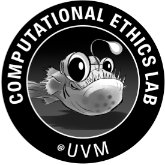

  

  <h1>Welcome</h1>

  <em>We are on the holy grail quest to understand multimodal foundation models.</em>

  In this Observable framework, you'll find a series of notes from the [Computational Ethics Lab](https://www.compethicslab.org/) about multimodal foundation models (FMs). Each week or so, we meet to talk about the recent advances in the domain. We keep track of our findings in this series of notebook.

  In the [preliminaries](./preliminaries/) directory, we put early meetings where we engage with the literature. As we have a better idea of what multimodal FMs capabilities (and most importatly, limitations), we will create new directories. In [papers deep dive](./papers), we take deep dive for any given paper in our [refs.bib](https://github.com/jstonge/multimodal-fms-at-uvm/blob/main/docs/refs.bib). 
  
  The git repo can be found [here](https://github.com/jstonge/multimodal-fms-at-uvm). The github.io where this app lives can be found [here](https://jstonge.github.io/multimodal-fms-at-uvm/).

  

  

  

      
  

  

